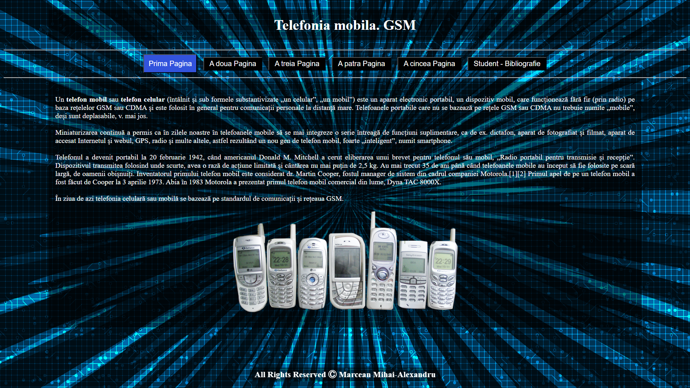
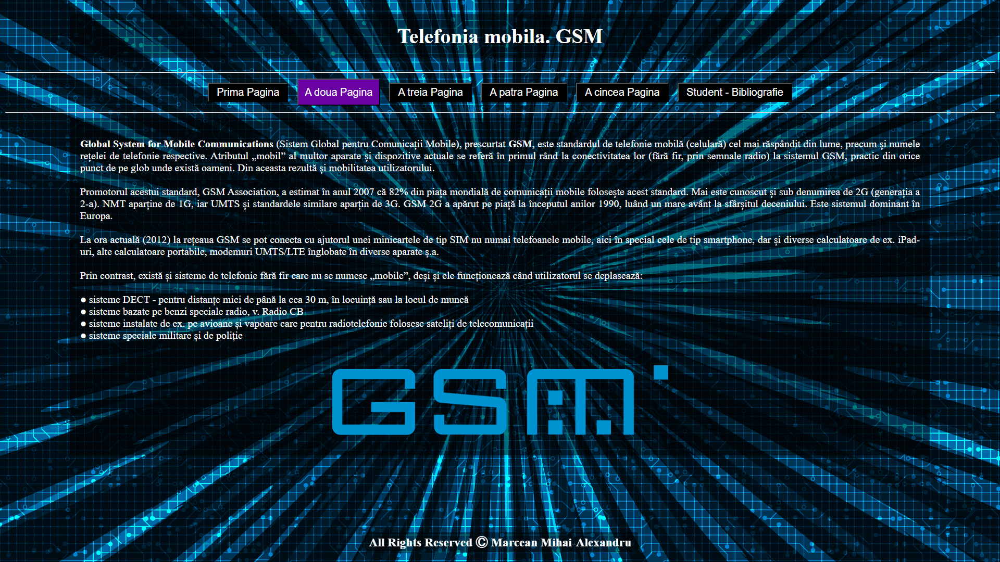
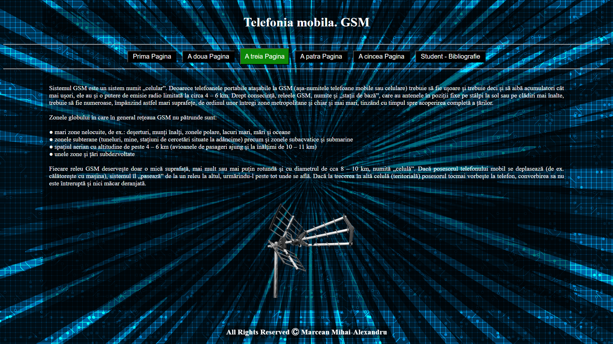
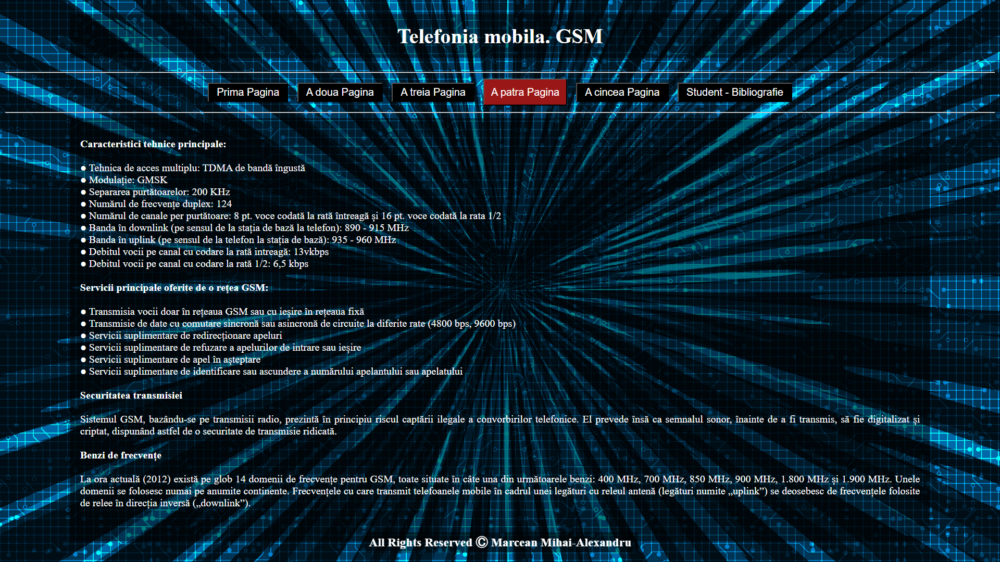
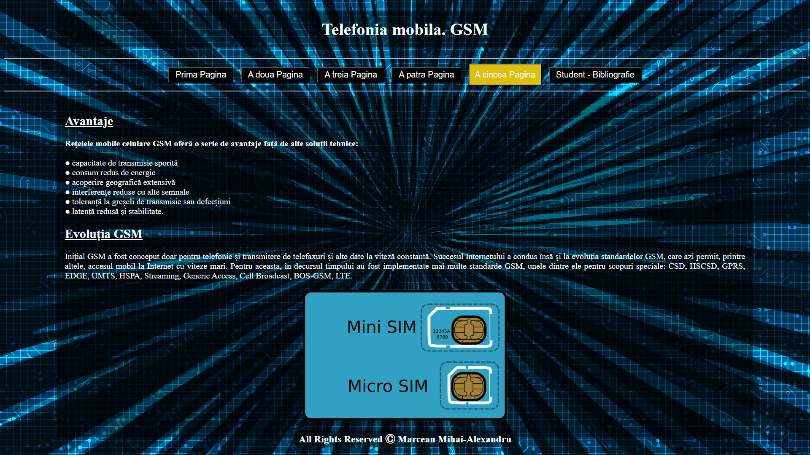

# GSM Mobile Project 📱

A web project built with **HTML** and **CSS**, showcasing information about GSM technology and the evolution of mobile phones.

## 📂 Project Structure
- 6 HTML pages linked through navigation buttons  
- Styled with CSS (backgrounds, hover effects, simple layout)  
- Informative content about mobile telephony and GSM networks  
- Images and text to illustrate the topic  

## 🚀 What I Learned
- The basics of **HTML & CSS** web development  
- How to design an interactive desktop-oriented website  
- Why using a proper IDE is better than Notepad for web development  

## 🖼️ Features
Each page includes:
- Custom background  
- Navigation buttons with hover effects  
- Centered and readable content  
- Fixed footer with author information

## 📸 Preview

